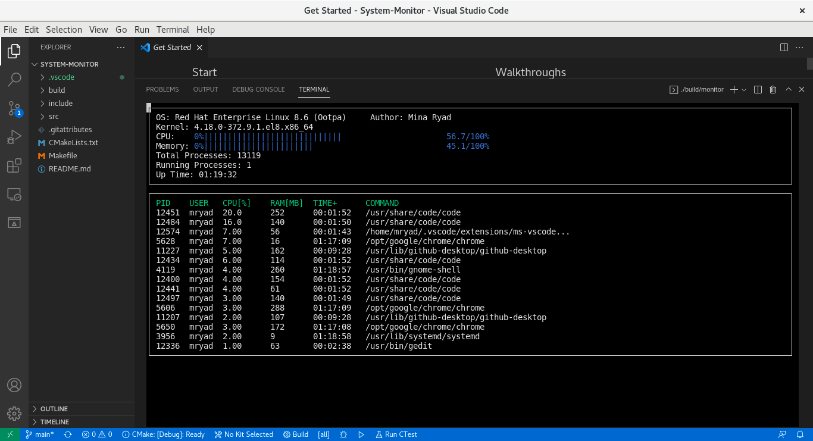

# System-Monitor
Linux os monitor (similar to HTOP)

 

## Description
* The System Monitor shows the OS version, Kernel, overall system CPU utilization, overall system memory usage, the total number of processes, the number of running process and the up time for the system.
* The system Monitor show 15 processes sorted with the highest CPU Utilization
* Also shows every process PID, User, CPU utilization, memory usage, time the process has been up and command line for the process

## ncurses
[ncurses](https://www.gnu.org/software/ncurses/) is a library that facilitates text-based graphical output in the terminal. This project relies on ncurses for display output.
## Make
This project uses [Make](https://www.gnu.org/software/make/). The Makefile has four targets:
* `build` compiles the source code and generates an executable
* `format` applies [ClangFormat](https://clang.llvm.org/docs/ClangFormat.html) to style the source code
* `debug` compiles the source code and generates an executable, including debugging symbols
* `clean` deletes the `build/` directory, including all of the build artifacts
